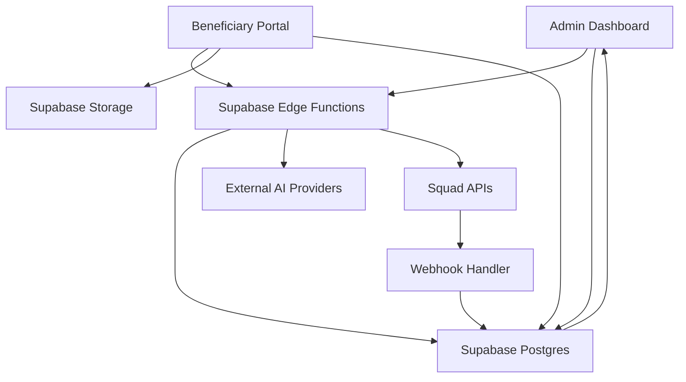

# PROVA Architecture

## Architecture Decision

We will build the MVP with a Supabase-first architecture.

This is the fastest stack that still gives us a serious backend, secure integrations, clean data modeling, and live observability.

For hackathon purposes, this architecture is a demo vehicle first.

We only need enough backend depth to support a believable on-screen flow and a strong presentation.

We do not need to fully productionize every part of the system during the hackathon window.

### Final Stack

- Frontend: React + TypeScript + Tailwind CSS + shadcn/ui
- Backend: Supabase Edge Functions
- Database: Supabase Postgres
- Auth: Supabase Auth
- File Storage: Supabase Storage
- Payments: Squad APIs
- AI Providers: external verification APIs for liveness, face comparison, OCR, and document checks
- Hosting: Render for frontend hosting if preferred
- Optional worker tier: Render background service only if Edge Functions become too limited for later phases

## Why This Stack Works

### React + TypeScript + Tailwind + shadcn/ui

- Fast to build
- Strong for polished demo UX
- Good for dashboards and guided onboarding
- Easy to keep consistent and responsive

### Supabase

- Postgres is strong enough for operational workflows and audit trails
- Storage handles selfie and document uploads
- Edge Functions can safely call Squad and AI providers with server-side secrets
- Auth gives us user accounts for admins and beneficiaries
- Realtime can update verification and payout status without building extra infrastructure

The key point is speed-to-demo.

Supabase lets us show real state changes quickly without building a large custom backend that judges will never directly appreciate.

### Render

Render is not required for the MVP backend.

Use it for:

- frontend hosting
- optional worker services
- later Python or queue-heavy workloads

If the AI pipeline stays as external API calls and simple trust orchestration, Supabase Edge Functions are enough.

## High-Level System Flow

In the hackathon version, parts of this flow may be simplified or controlled as long as the trust-decision-to-payout story remains clear and convincing.

## Product Modules

### 1. Beneficiary Onboarding

Purpose:
Collect the identity and payout information required for verification.

Inputs:

- full name
- email or phone
- institution or program identifier
- bank account details
- student ID or program document
- selfie or live capture

Main services:

- React form flow
- Supabase Storage for uploads
- Supabase Postgres for beneficiary records

### 2. Verification Orchestration

Purpose:
Call external AI services and combine the results into one trust decision.

Possible external checks:

- liveness detection
- face match between selfie and ID
- OCR and document extraction
- document tamper or fraud signals

Internal trust logic:

- duplicate face or identity reuse
- suspicious bank account reuse
- missing or inconsistent records
- configurable score thresholds

Output:

- trust score
- decision status: `approved`, `review`, `rejected`
- reason codes

Main services:

- Supabase Edge Function for orchestration
- Supabase Postgres for result persistence

### 3. Payout Orchestration

Purpose:
Release money only for approved beneficiaries.

Squad flow:

1. Perform account lookup.
2. Confirm account name match.
3. Initiate transfer.
4. Re-query status when needed.
5. Write all outcomes to audit logs.

Main Squad endpoints:

- `POST /payout/account/lookup`
- `POST /payout/transfer`
- `POST /payout/requery`
- `GET /merchant/balance`

### 4. Review And Audit Layer

Purpose:
Give operators a safe workflow for flagged cases.

Features:

- manual review queue
- reviewer notes
- override decision controls
- payout history
- webhook event log
- immutable audit trail for verification and transfers

## Suggested Data Model

### `profiles`

- `id`
- `role` (`admin` or `beneficiary`)
- `full_name`
- `email`
- `created_at`

### `programs`

- `id`
- `name`
- `organization_name`
- `program_type`
- `created_at`

### `beneficiaries`

- `id`
- `program_id`
- `profile_id`
- `full_name`
- `student_identifier`
- `bank_code`
- `account_number`
- `account_name_lookup`
- `status`
- `created_at`

### `verification_submissions`

- `id`
- `beneficiary_id`
- `selfie_file_path`
- `document_file_path`
- `submitted_at`

### `verification_results`

- `id`
- `beneficiary_id`
- `liveness_score`
- `face_match_score`
- `document_score`
- `risk_score`
- `decision`
- `reason_codes`
- `raw_provider_summary`
- `review_notes`
- `created_at`

### `payout_batches`

- `id`
- `program_id`
- `batch_name`
- `total_amount`
- `status`
- `created_by`
- `created_at`

### `payout_items`

- `id`
- `batch_id`
- `beneficiary_id`
- `amount`
- `decision_snapshot`
- `squad_transaction_reference`
- `squad_status`
- `released_at`
- `updated_at`

### `audit_events`

- `id`
- `entity_type`
- `entity_id`
- `event_type`
- `payload`
- `created_at`

## Trust Decision Model

We do not need to train a model from scratch for the MVP.

The intelligence layer can be a rules-plus-scores engine built around external AI outputs.

Example decision logic:

- approve when liveness passes, face match is above threshold, document result is clean, and bank details are valid
- send to review when one major signal is weak but not clearly fraudulent
- reject when liveness fails, face mismatch is severe, or identity data conflicts strongly

This is technically credible, explainable, and fast to build.

That is the right level of depth for this hackathon.

The goal is not to prove maximum AI sophistication.

The goal is to prove that an interpretable trust layer before payout is useful, believable, and ready for deeper implementation later.

## API And Webhook Design

These integration surfaces should stay as small as possible for the hackathon build.

Only flows that materially improve the demo should be implemented end-to-end.

Everything else can remain simplified, deferred, or represented through controlled demo paths.

### Core Edge Functions

- `submit-beneficiary-verification`
- `run-verification-pipeline`
- `review-beneficiary`
- `release-approved-payouts`
- `requery-transfer-status`
- `squad-webhook-handler`

### Security Responsibilities

- keep Squad and AI provider secrets only in server-side environment variables
- verify webhook signatures before writing payout events
- never trigger transfer directly from the browser
- log all release and override actions

## MVP Scope

### In Scope

- scholarship or stipend payout workflow
- beneficiary onboarding
- external AI verification calls
- trust score and decision engine
- Squad account lookup and transfer
- payout status requery
- admin review dashboard
- audit log

### Out Of Scope For MVP

- training custom AI models
- multi-tenant enterprise billing
- direct debit mandates
- payroll-specific attendance analytics
- dynamic virtual account profiling requirements
- restricted-benefit payout modes through VAS

## Squad-Specific Constraints We Must Respect

- transfer references must be unique
- account lookup should happen before transfer
- transfer requery is necessary for uncertain outcomes
- some advanced products such as dynamic virtual accounts require profiling and GTBank-specific conditions
- virtual account creation also has GTBank and profiling constraints, so it should not be assumed in the MVP unless already enabled

Because of those constraints, the safest live demo centers on payout transfer, not on advanced profiled products.

## Deployment Plan

### Recommended MVP Deployment

- Frontend on Render static site or web service
- Supabase project for database, auth, storage, and edge functions
- External AI providers configured through Supabase secrets
- Squad sandbox credentials stored in Supabase secrets

### Optional Later Extension

If we later need heavier image processing, video handling, or Python workers:

- add a small Render backend service
- keep Supabase as the system of record
- let Edge Functions coordinate with the worker

## Why This Architecture Matches The Guide

- It supports a real end-to-end product demo
- It gives us an explainable AI layer instead of a vague claim
- It keeps Squad at the center of money movement
- It is narrow enough to build and broad enough to scale into a platform story

This is the right architecture for a hackathon MVP that needs to look serious, move quickly, and still stand up in Q and A.
